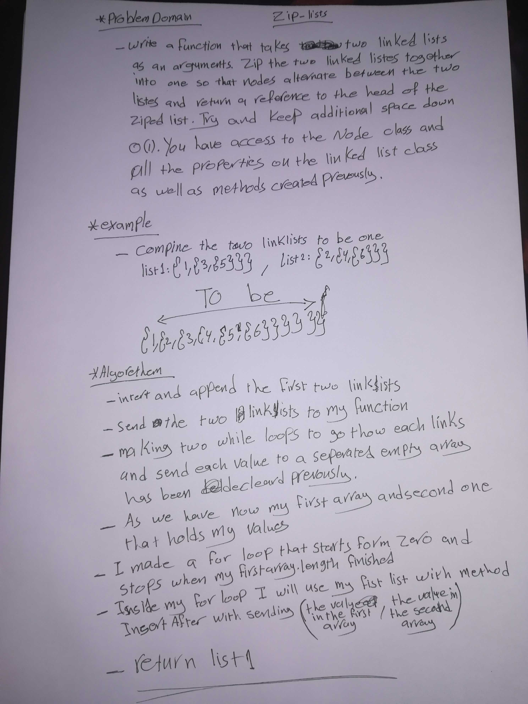

# zip-lists

## Problem Domain

Write a function called zipLists which takes two linked lists as arguments. Zip the two linked lists together into one so that the nodes alternate between the two lists and return a reference to the head of the zipped list.

## Approach and Efficiency

I applied the information I gathered through my reading assignments and class demonstration to build ths application.

## Solution

[ll-insertion](https://github.com/401-advanced-javascript-MalekHassan/data-structures-and-algorithms/blob/main/Data-Structures/zip-Lists/zip-lists.js)

