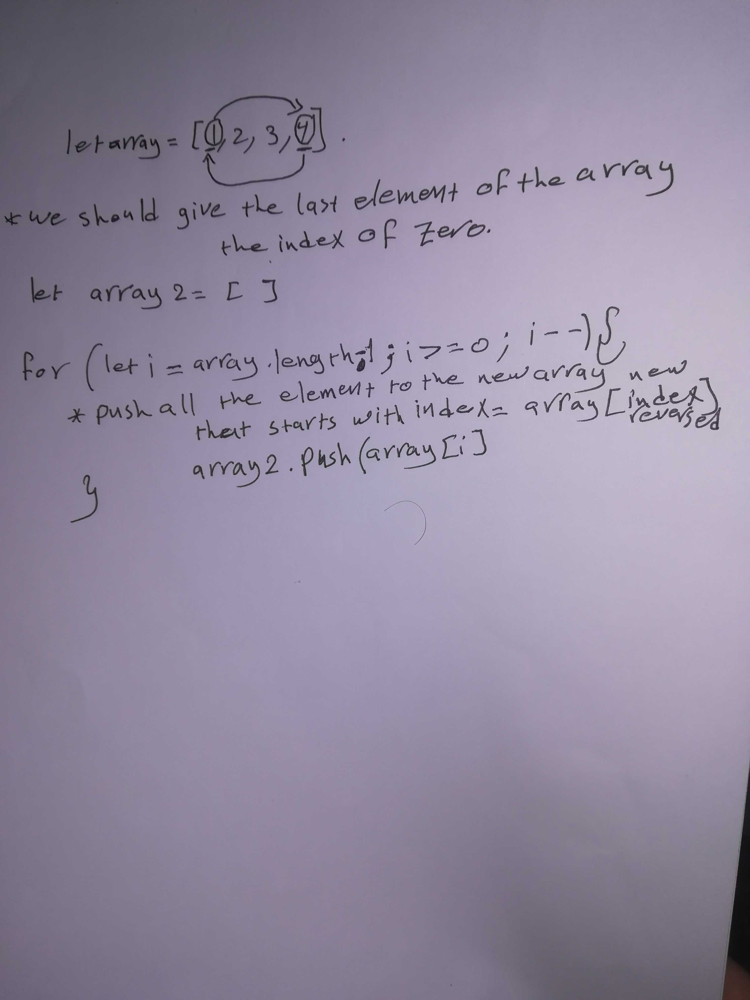

# Code Challenge 1: Reversed Array 

## Problem Domain

Write a function called reverseArray which takes an array as an argument. Without utilizing any of the built-in methods available to your language, return a new array with elements from input array in reversed order.

## Approach and Efficiency 
To revers an Array we should make the last element of the array have index of zero and start to increase the counter, and by taking the the length of the array and decreasing the number of it we can sort any array in reverse.

## solution 
 
 
